# Quardrant Analysis

## [Experiment 01](exp01) 

| Paper| Code |
|-------|--------|
|   | 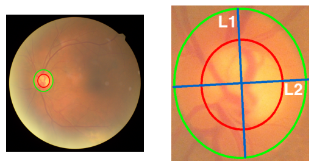 | 

> Results

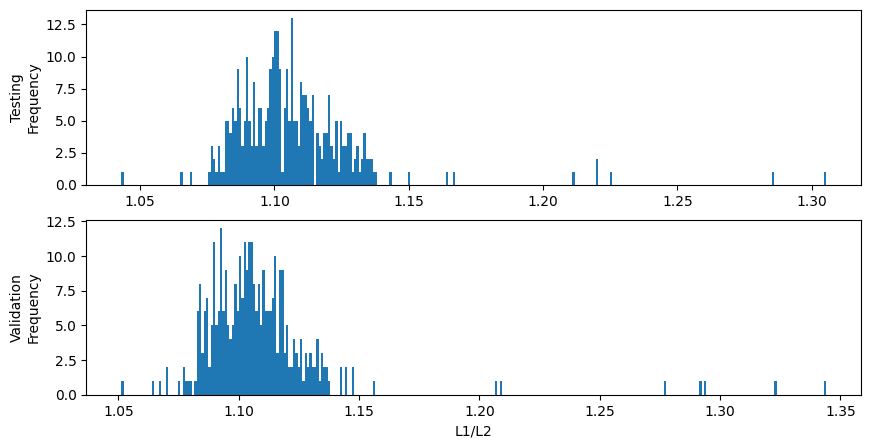

## [Experiment 02](exp02) 

| Paper| Code |
|-------|--------|
| 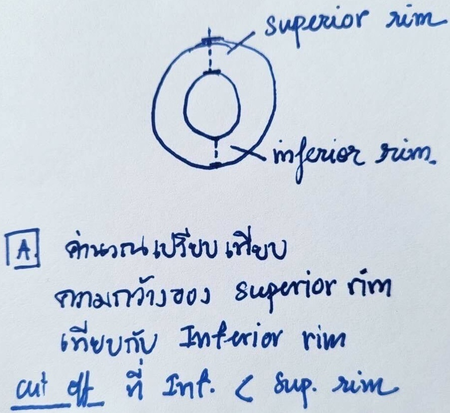  | 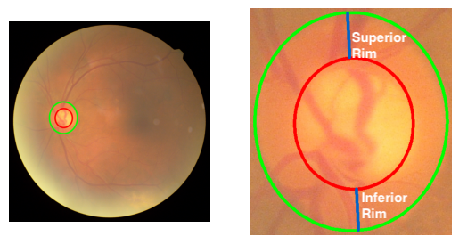 | 

> Results

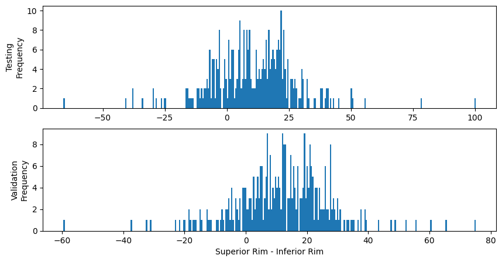

## [Experiment 03](exp03) 

| Paper| Code |
|-------|--------|
| 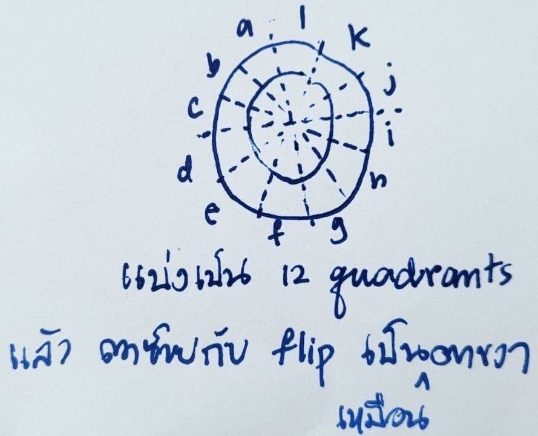  | 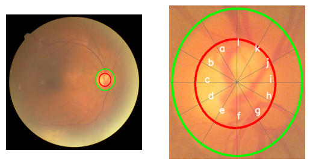 | 

> Results

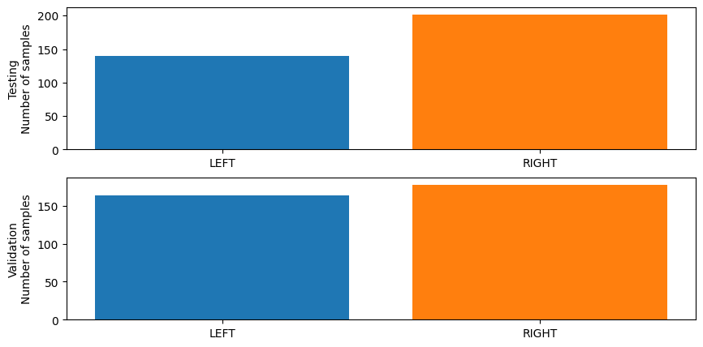

## [Experiment 04_b](exp04_b) 

| Paper| Code |
|-------|--------|
|   | 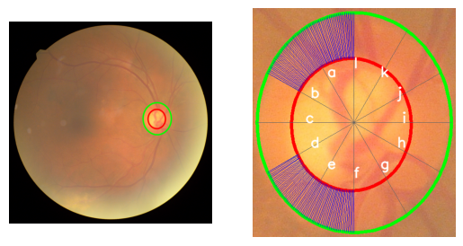 | 

> Results

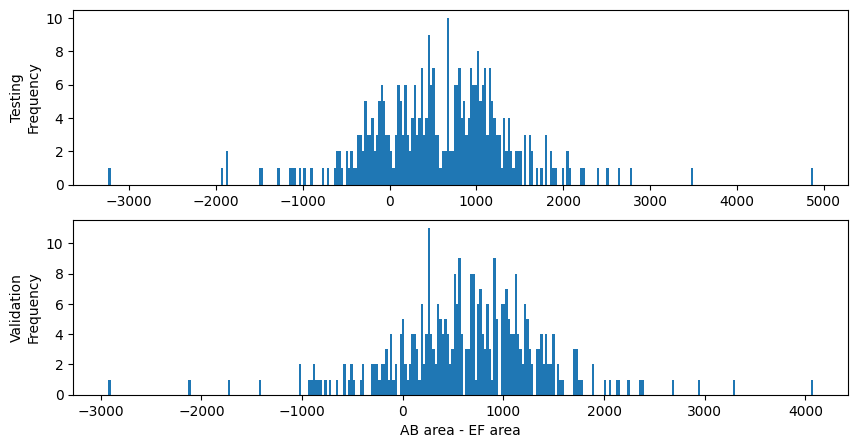

## [Experiment 04_c](exp04_c) 

| Paper| Code |
|-------|--------|
| 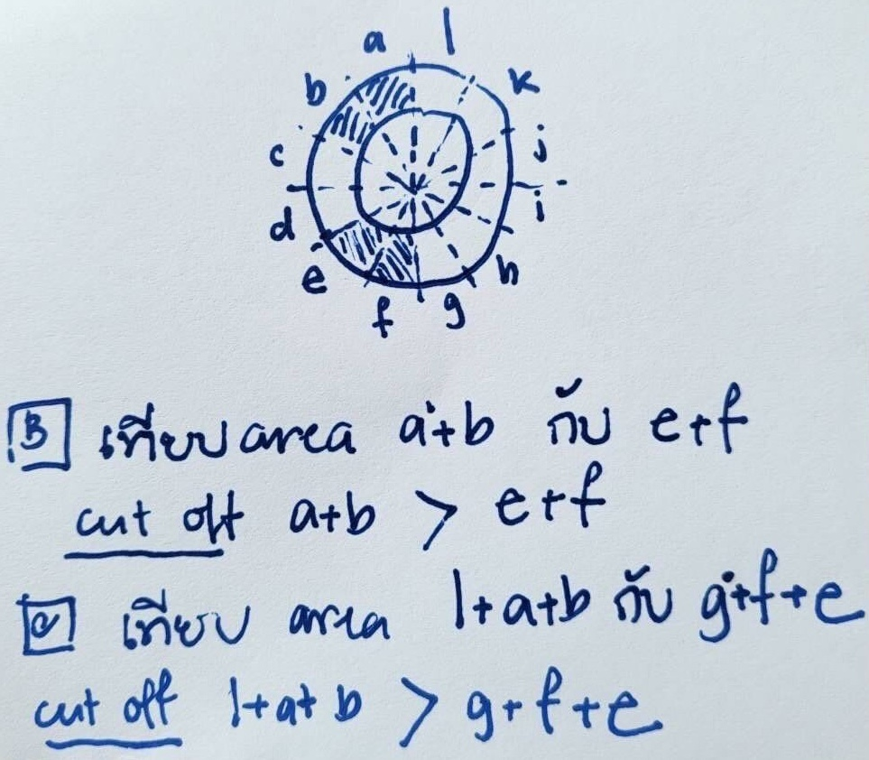  | 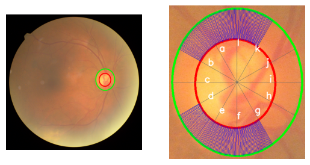 | 

> Results

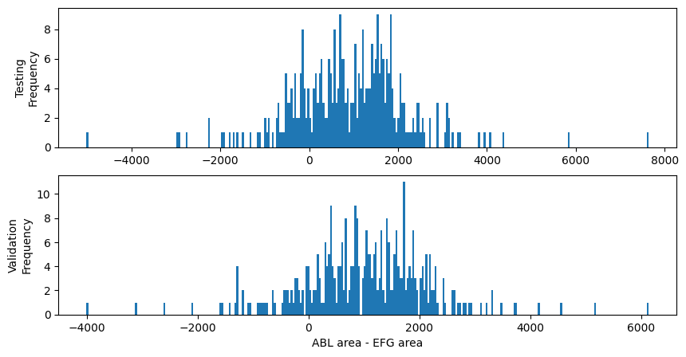

