# YOLOv8_CDR

This work utilized YOLOv8 to segment the cup and disc areas in color fundus photography (CFP) captured by NIDEK and EIDON cameras, followed by the calculation of the cup-to-disc ratio for glaucoma detection.

This work utilizes the same dataset as the project available at [https://github.com/biodatlab/si-eye-screening](https://github.com/biodatlab/si-eye-screening)

## Dataset

|       | Total | Glaucoma (NIDEK/EIDON) | Normal (NIDEK/EIDON) |
| :---: | -----: | -----: | -----: |
| Train | 2,732 | 128 (28/100) | 2,604(1,194/1,410) |
| Test  |   342 |               9 (1/8) | 333 (172/161) |
| Val   |   342 |              15 (5/10)| 327 (164/163) |

## Image segmentation

```
python src/train_yolov8.py
```

Training for 100 epochs 

|       | F1-score | Precision | Recall | Precision-Recall |
| :---: | -------- | --------- | ------ | ---------------- |
| Box   | 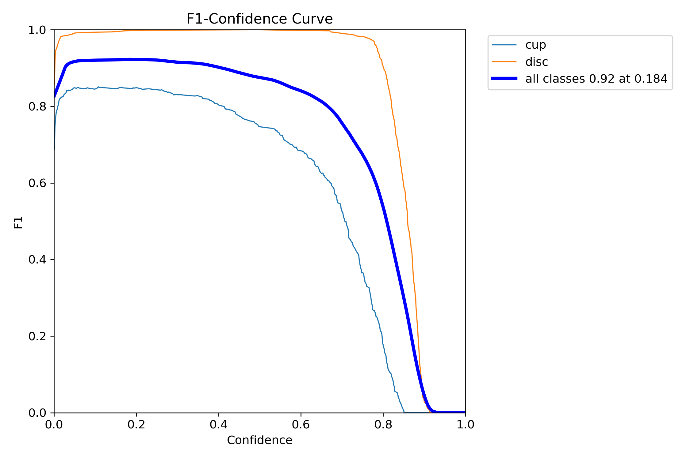 | 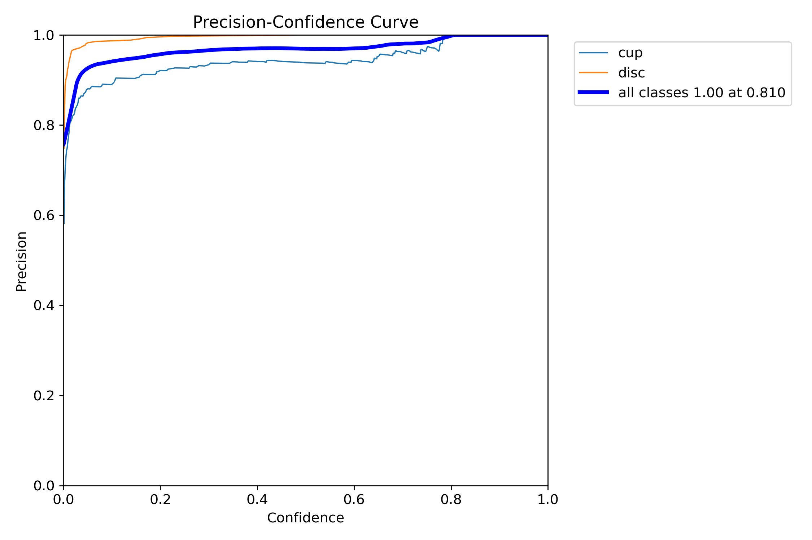 | 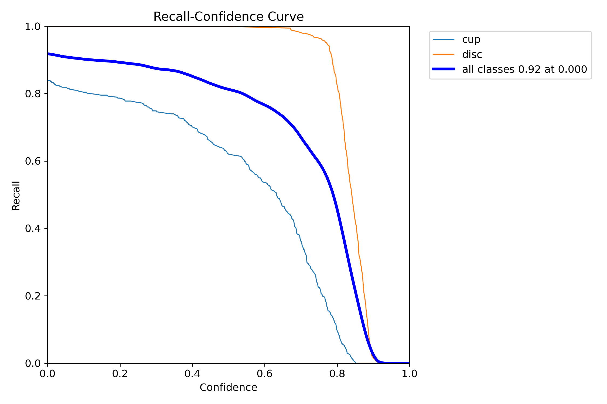 | 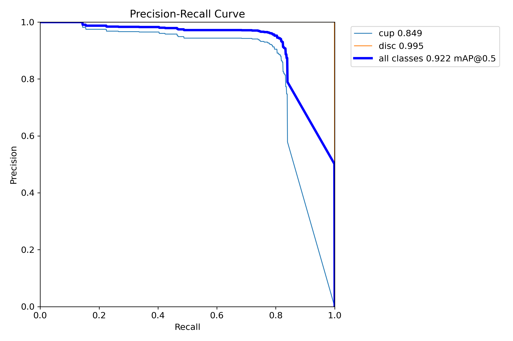 |
| Box   | 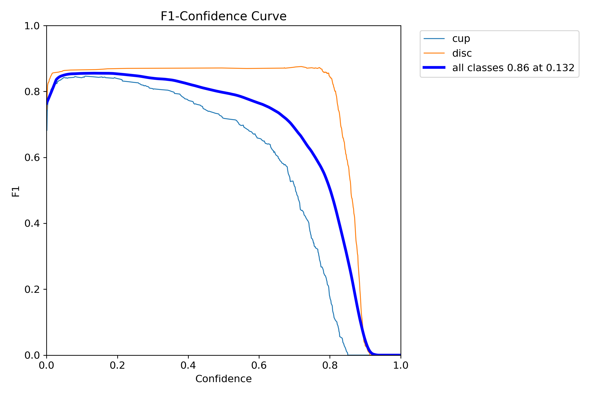 | 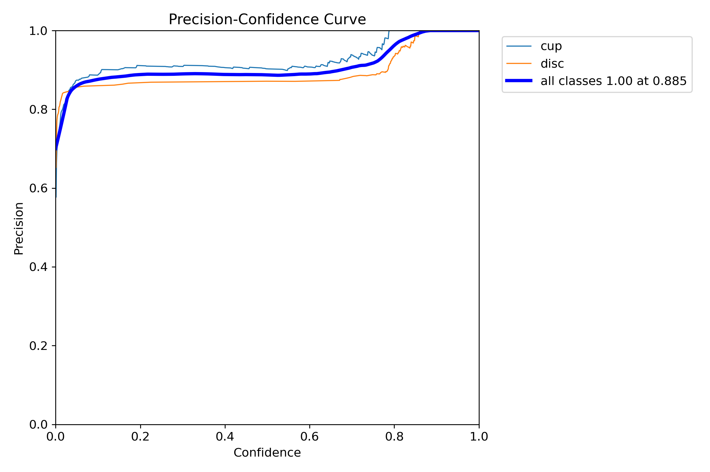 |  | 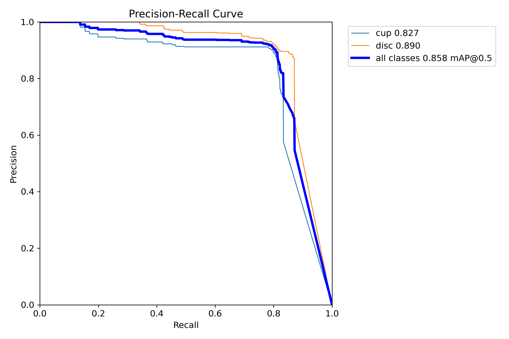 |

You can download the pre-trained model  [here](/model)

### Evaluation

| Class | Images | Instances | Box(P) | Box(R) | Box mAP50 | Box mAP50-95 | Mask(P) | Mask(R) | Mask mAP50 | Mask mAP50-95 |
|-------|--------|-----------|--------|--------|-----------|--------------|---------|---------|------------|---------------|
| all   | 342    | 684       | 0.978  | 0.968  | 0.983     | 0.708        | 0.974   | 0.963   | 0.980      | 0.580         |
| cup   | 342    | 342       | 0.957  | 0.936  | 0.972     | 0.555        | 0.963   | 0.942   | 0.973      | 0.552         |
| disc  | 342    | 342       | 1.000  | 1.000  | 0.995     | 0.862        | 0.985   | 0.985   | 0.986      | 0.609         |

## Glaucoma detection

This work detects glaucoma based on the cup-to-disc ratio (CDR). If the CDR is greater than 0.7, it is considered suspect for glaucoma; otherwise, it is classified as normal.

:exclamation: What are the differences between this work and the default inferencing?

1. Adjusting 'conf' and 'iou' in YOLOv8 Inference:

Default Inferencing:
```
results = model({image_path}, conf=0.25, iou=0.7)
```

This work's Inferencing:
```
results = model({image_path}, conf=0.001, iou=0.8)
```

&nbsp;&nbsp;&nbsp;&nbsp; For more details on adjusting parameters with YOLOv8, refer to the [documentation.](https://docs.ultralytics.com/usage/cfg/#predict-settings)

2. Handling Multiple Detections

&nbsp;&nbsp;&nbsp;&nbsp; Due to the parameter adjustments made in the previous step, it is possible to detect more than one cup and disc per image, which is unusual.

This work implements a simple logic to identify the correct cup and disc: It first identifies the largest disc that contains a cup. Then, it finds the largest cup within that disc.
```
results = model(input_image_path,conf=0.001,iou=0.8)
cup_arr = []
dis_arr = []
for result in results:
    if result.masks is None:
        continue
    for mask, box in zip(result.masks.xy, result.boxes):
        points = np.int32([mask])
        if box.cls[0] == 0:
            if 0 not in points[0]:
                cup_arr.append(points[0])
        if box.cls[0] == 1:
            if 0 not in points[0]:
                dis_arr.append(points[0])
cup_polygons = [Polygon([tuple(point) for point in coords]) for coords in cup_arr]
dis_polygons = [Polygon([tuple(point) for point in coords]) for coords in dis_arr]
result = []
for dis_index, dis_poly in enumerate(dis_polygons):
    contained_cup_polygons = [red_poly for red_poly in cup_polygons if red_poly.within(dis_poly)]
    if contained_cup_polygons:
        highest_cup_poly = max(contained_cup_polygons, key=lambda p: max(point[1] for point in p.exterior.coords)-min(point[1] for point in p.exterior.coords)) 
        result.append({
            "dis_polygon_index": dis_index,
            "dis_polygon_area": dis_poly.area,
            "largest_cup_polygon": highest_cup_poly,
            "largest_cup_polygon_index": cup_polygons.index(highest_cup_poly),
            "largest_cup_polygon_area": highest_cup_poly.area
        })
if result:
    largest_dis_poly_result = max(result, key=lambda x: x["dis_polygon_area"])
else:
    print("No red polygons are contained within any green polygons.")
```

```
python src/inference.py {input_image_path} {output_image_path} {input_label_path}
```

Example output

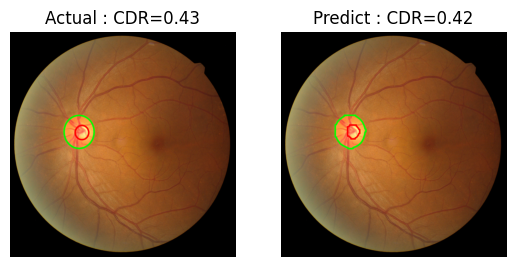

### Experimental results

Confusion matrix

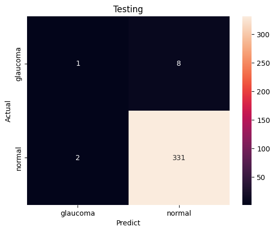 

#### In testing dataset

> 8 samples predicted as normal but are actually glaucoma

| #01  | #02 | #03 | #04 | #05 | #06 | #07 | #08 | 
| ---- | --- | --- | --- | --- | --- | --- | --- |
| 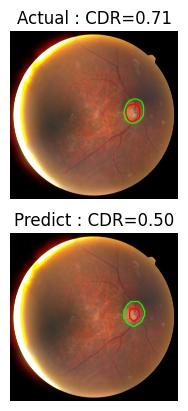 | 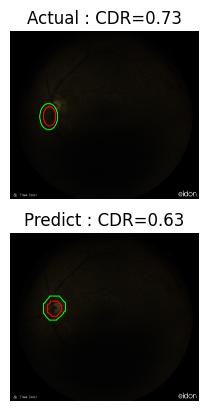 |  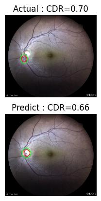 |  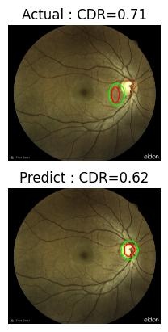 |  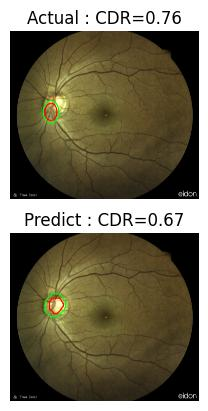 |  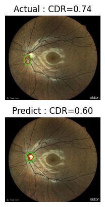 |  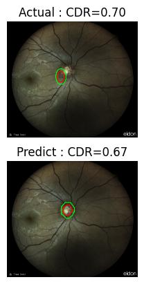 |  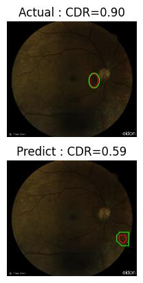 |

> 2 samples predicted as glaucoma but are actually normal

| #01  | #02 |
| -------- | ---------- | 
| 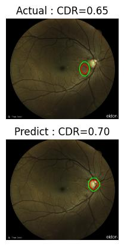 | 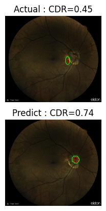 |

